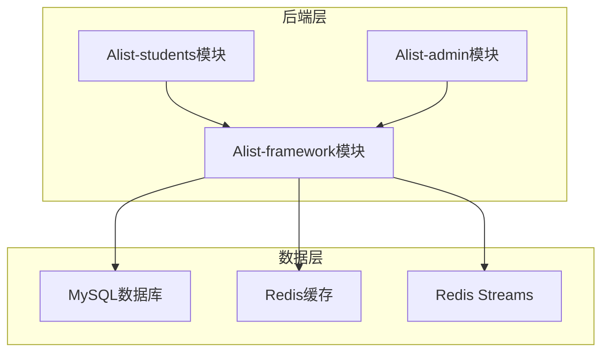
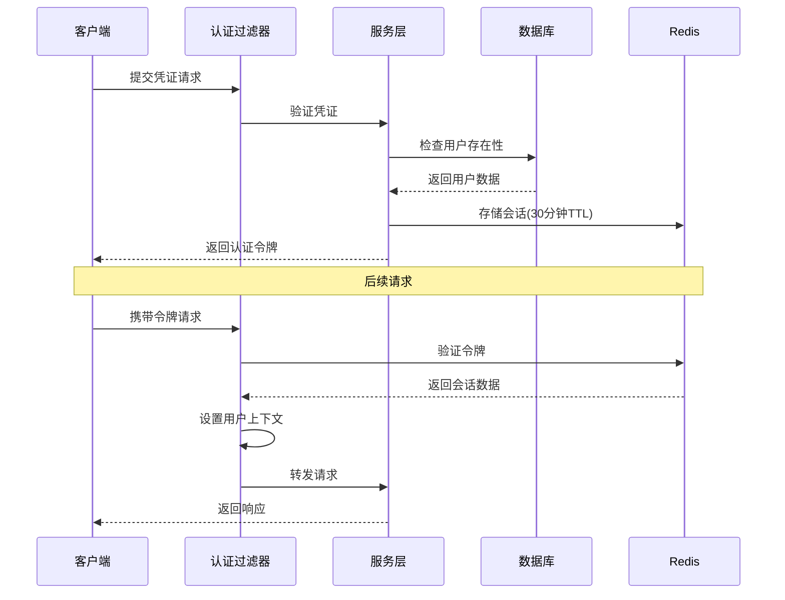
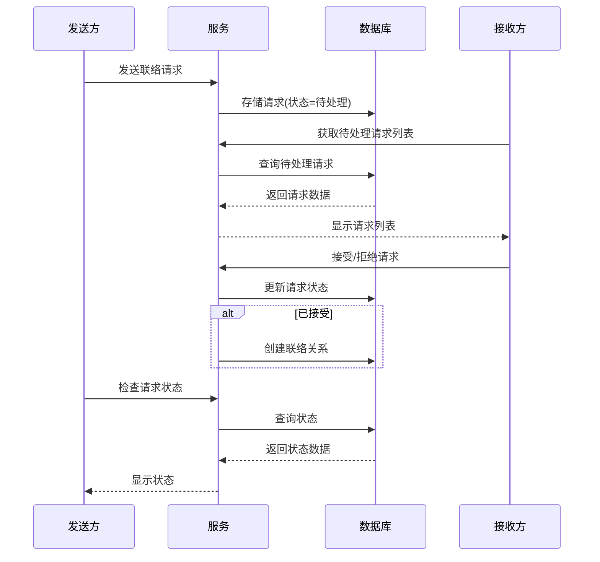

# AddressList 通讯录系统

<p align="center">
  
  
  
  
  
</p>

## 📋 项目概述

AddressList 是一款面向教育机构设计的高可用、安全可靠的分布式通讯录管理系统。该系统实现了学生信息的数字化管理，支持跨年级社交网络和校友联络功能。

本系统提供了一套完整的学生通讯录解决方案，具备完善的安全特性、管理控制功能和友好的用户界面。

## ✨ 功能特性

### 👨‍🎓 学生门户

- **注册与认证**
  - 带管理员审批流程的安全账号注册
  - 基于令牌的认证机制（30分钟会话超时）
  - 密码安全要求（8位以上，包含大小写字母和数字）
  - 登录状态检查与登出功能

- **通讯录管理**
  - 自助式个人资料管理
  - 增删改查联系人信息
  - 字段级权限控制（可编辑：工作单位、城市、电话、邮箱；只读：专业、班级、学号）
  - 高级搜索过滤功能
  - 敏感信息数据脱敏

- **联络请求**
  - 搜索其他学生信息
  - 发送带自定义消息的联络请求
  - 处理收到的联络请求（接受/拒绝/删除）
  - 按状态查看联络请求（待处理/已接受/已拒绝/已删除）
  - 追踪已发送的联络请求

### 👨‍💼 管理门户

- **账号管理**
  - 审核批准学生注册申请
  - 查看待审/已批准/已拒绝的注册列表
  - 封禁/解封用户账号
  - 检查注册审核状态

- **系统配置**
  - 管理院系结构（学院、专业、班级）
  - 更新学术实体间关系
  - 按班级查看学生/按专业查看班级

- **公告管理**
  - 创建、更新和删除公告
  - 管理公告生命周期（草稿/已发布/已下架）
  - 恢复已删除公告
  - 按状态查看公告

- **数据导入导出**
  - 通过Excel批量导入学生数据
  - 导出全部学生数据到Excel
  - 按专业/班级/入学年份/毕业年份条件导出

## 🏗️ 系统架构

AddressList 采用模块化、可扩展的架构设计，确保系统可靠性和高性能。

### 系统组件



### 技术栈

- **后端**
  - Java 17
  - Spring Boot 2.5.0
  - MyBatis Plus 3.5.7
  - RESTful API 设计

- **数据存储**
  - MySQL（关系型数据）
  - Redis（缓存、会话管理、分布式锁）
  - Redis Streams（事件处理）

- **库与工具**
  - Redisson（分布式对象）
  - Hutool（工具库）
  - EasyExcel（Excel处理）
  - Transmittable Thread Local（上下文传播）
  - Guava（核心工具）
  - FastJSON（JSON处理）

### 核心流程

#### 认证流程



#### 联络请求流程



## 🚀 快速开始

### 环境要求

- Java 17 或更高版本
- Maven 3.6+
- MySQL 5.7+
- Redis 6.0+

### 安装指南

1. 克隆代码仓库
   ```bash
   git clone https://github.com/AillemaCc/AddressList.git
   cd AddressList
   ```

2. 配置数据库连接（修改application.yml）
   ```yaml
   spring:
     datasource:
       url: jdbc:mysql://localhost:3306/alist
       username: 你的用户名
       password: 你的密码
       driver-class-name: com.mysql.cj.jdbc.Driver
   ```

3. 配置Redis连接
   ```yaml
   spring:
     redis:
       host: localhost
       port: 6379
       database: 0
       lettuce:
         pool:
           max-active: 20
           max-idle: 10
           min-idle: 5
           max-wait: 3000ms
   ```

4. 构建项目
   ```bash
   mvn clean package
   ```

5. 运行应用
   ```bash
   java -jar Alist-students/target/Alist-students.jar
   java -jar Alist-admin/target/Alist-admin.jar
   ```

## 📚 API文档

### 学生API端点

#### 认证相关
| 端点                  | 方法   | 描述             | 认证要求 |
| --------------------- | ------ | ---------------- | -------- |
| `/api/stu/register`   | POST   | 学生注册         | 否       |
| `/api/stu/login`      | POST   | 学生登录         | 否       |
| `/api/stu/checkLogin` | GET    | 检查登录状态     | 否       |
| `/api/stu/logout`     | DELETE | 学生登出         | 是       |
| `/api/stu/getRemark`  | GET    | 获取注册审核结果 | 否       |

#### 通讯录管理
| 端点                                  | 方法   | 描述             | 认证要求 |
| ------------------------------------- | ------ | ---------------- | -------- |
| `/api/stu/info/contact/add`           | PUT    | 添加联系人信息   | 是       |
| `/api/stu/info/contact/update`        | POST   | 更新联系人信息   | 是       |
| `/api/stu/info/contact/delete`        | DELETE | 删除联系人信息   | 是       |
| `/api/stu/info/contact/restore`       | POST   | 恢复已删除联系人 | 是       |
| `/api/stu/info/contact/query`         | GET    | 查询特定联系人   | 是       |
| `/api/stu/info/contact/list`          | GET    | 获取所有联系人   | 是       |
| `/api/stu/info/contact/listAllDelete` | GET    | 获取已删除联系人 | 是       |

#### 联络请求管理
| 端点                     | 方法   | 描述             | 认证要求 |
| ------------------------ | ------ | ---------------- | -------- |
| `/api/stu/querySomeone`  | GET    | 搜索学生         | 是       |
| `/api/stu/send`          | PUT    | 发送联络请求     | 是       |
| `/api/stu/acceptSingle`  | PUT    | 接受请求         | 是       |
| `/api/stu/refuseSingle`  | PUT    | 拒绝请求         | 是       |
| `/api/stu/deleteSingle`  | DELETE | 删除请求         | 是       |
| `/api/stu/listAll`       | GET    | 获取所有有效请求 | 是       |
| `/api/stu/listAllAccept` | GET    | 获取已接受请求   | 是       |
| `/api/stu/listAllRefuse` | GET    | 获取已拒绝请求   | 是       |
| `/api/stu/listAllDelete` | GET    | 获取已删除请求   | 是       |
| `/api/stu/listAllSend`   | GET    | 获取已发送请求   | 是       |

### 管理员API端点

#### 认证相关
| 端点                    | 方法   | 描述         | 认证要求 |
| ----------------------- | ------ | ------------ | -------- |
| `/api/admin/login`      | POST   | 管理员登录   | 否       |
| `/api/admin/checkLogin` | GET    | 检查登录状态 | 否       |
| `/api/admin/logout`     | DELETE | 管理员登出   | 是       |

#### 用户管理
| 端点                           | 方法 | 描述               | 认证要求 |
| ------------------------------ | ---- | ------------------ | -------- |
| `/api/admin/auditList`         | GET  | 获取待审注册列表   | 是       |
| `/api/admin/validList`         | GET  | 获取已批准注册列表 | 是       |
| `/api/admin/refuseList`        | GET  | 获取已拒绝注册列表 | 是       |
| `/api/admin/accept`            | POST | 批准注册           | 是       |
| `/api/admin/refuse`            | POST | 拒绝注册           | 是       |
| `/api/admin/checkReviewStatus` | POST | 检查审核状态       | 是       |
| `/api/admin/ban`               | POST | 封禁学生           | 是       |
| `/api/admin/unBan`             | POST | 解封学生           | 是       |

#### 公告管理
| 端点                          | 方法   | 描述           | 认证要求 |
| ----------------------------- | ------ | -------------- | -------- |
| `/api/admin/add`              | PUT    | 添加公告       | 是       |
| `/api/admin/update`           | POST   | 更新公告       | 是       |
| `/api/admin/delete`           | DELETE | 删除公告       | 是       |
| `/api/admin/release`          | POST   | 发布公告       | 是       |
| `/api/admin/pullOff`          | POST   | 下架公告       | 是       |
| `/api/admin/restore`          | POST   | 恢复公告       | 是       |
| `/api/admin/queryAllValid`    | GET    | 获取有效公告   | 是       |
| `/api/admin/queryAllDeleted`  | GET    | 获取已删除公告 | 是       |
| `/api/admin/queryAllReleased` | GET    | 获取已发布公告 | 是       |
| `/api/admin/queryAllDraft`    | GET    | 获取草稿公告   | 是       |
| `/api/admin/queryAllPullOff`  | GET    | 获取已下架公告 | 是       |

#### 院系结构
| 端点                          | 方法 | 描述              | 认证要求 |
| ----------------------------- | ---- | ----------------- | -------- |
| `/api/admin/addClass`         | PUT  | 添加班级          | 是       |
| `/api/admin/updateClass`      | POST | 更新班级          | 是       |
| `/api/admin/updateClassMA`    | POST | 更新班级-专业关系 | 是       |
| `/api/admin/listClassStu`     | GET  | 获取班级学生列表  | 是       |
| `/api/admin/updateMajor`      | POST | 更新专业          | 是       |
| `/api/admin/listMajorClass`   | GET  | 获取专业班级列表  | 是       |
| `/api/admin/updateAcademy`    | POST | 更新学院          | 是       |
| `/api/admin/listAcademyMajor` | GET  | 获取学院专业列表  | 是       |

#### 数据导入导出
| 端点                                       | 方法 | 描述             | 认证要求 |
| ------------------------------------------ | ---- | ---------------- | -------- |
| `/api/admin/execl/importStuDef`            | POST | 导入学生数据     | 是       |
| `/api/admin/execl/exportStuDef`            | GET  | 导出所有学生数据 | 是       |
| `/api/admin/execl/exportStuDefByCondition` | GET  | 条件导出学生数据 | 是       |

## 🔧 高级功能

### 缓存架构

系统采用基于Redis的复杂缓存策略提升性能：

- **多级缓存**：Redis分布式缓存+本地高频数据内存缓存
- **缓存优先查询策略**：先查缓存再查数据库
- **事件驱动缓存失效**：使用Redis Streams实现异步缓存更新
- **回退机制**：事件处理失败时同步重建缓存

### 安全特性

- **基于令牌的认证**：Redis会话管理
- **线程上下文传播**：使用TransmittableThreadLocal传递用户上下文
- **请求过滤**：拦截未授权请求
- **频率限制**：防止系统资源滥用
- **操作日志**：记录敏感操作及IP信息

### 性能优化

- **批量处理**：高效处理大数据集（每批100-500条记录）
- **分页查询**：减少内存占用和响应时间
- **分布式锁**：防止并发操作竞态条件
- **异步处理**：非阻塞操作提高吞吐量

## 🤝 参与贡献

我们欢迎任何形式的贡献！请随时提交Pull Request。

1. Fork本仓库
2. 创建特性分支 (`git checkout -b feature/新特性`)
3. 提交更改 (`git commit -m '添加了新特性'`)
4. 推送到分支 (`git push origin feature/新特性`)
5. 创建Pull Request

## 📄 开源协议

本项目采用MIT开源协议，详见LICENSE文件。

## 🙏 致谢

- Spring Boot团队提供的优秀框架
- MyBatis Plus简化了数据库操作
- Redis社区提供的强大缓存方案
- 所有帮助完善本项目的贡献者

---

<p align="center">
  由 <a href="https://github.com/AillemaCc">AillemaCc</a> 倾情打造 ❤️
</p>

您可能想了解的Wiki页面：
- [项目概述 (AillemaCc/AddressList)](/wiki/AillemaCc/AddressList#1)
